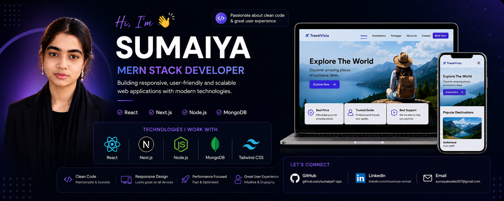

<!-- Banner -->

  

<h1 align="center">Hi 👋, I'm Sumaiya</h1>
<h3 align="center">💻 MERN Stack Developer</h3>

---
## 🙋‍♂️ About Me

I'm a passionate MERN Stack Developer focused on building responsive, scalable, and user-friendly web applications using modern technologies.

*   📍 Based in Bangladesh
*   📚 Currently learning **Next.js & TypeScript**
*   🚀 Built **Pawsome Haven** — A comprehensive Full-Stack Pet Adoption Platform
*   🌍 Working on a **Tourism Website** (TravelVista) using MERN Stack
*   🎯 Goal: Build highly scalable, secure, and production-ready Full-Stack applications
*   💬 Ask me about: **React, Next.js, Node.js, Express, MongoDB, and Secure Auth Workflows**

---

## 💼 Featured Projects

### 🐾 Pawsome Haven — Pet Adoption Platform
*   **Description:** A compassionate full-stack animal welfare web application engineered for pet adoptions. Features user dashboards, role authorization, and smooth dynamic listing controls.
*   **Tech Stack:** React.js, Node.js, Express.js, MongoDB, Tailwind CSS, BetterAuth
*   **🔗 Live Demo:** [Visit Pawsome Haven](https://pet-adoption-one-tau.vercel.app/)
*   **🛠️ Source Code:** [GitHub Repository](https://github.com/sumaiya7-ops/Pet-Adoption.git)

### 🌍 Tourism Website (TravelVista)
*   **Description:** A modern travel booking & exploration platform featuring fluid UI transitions, persistent data storage, and highly secure operational server channels.
*   **Tech Stack:** React.js, Node.js, MongoDB, Tailwind CSS, Appwrite
*   **🔗 Live Demo:** [Visit TravelVista](https://sumaiya7-ops.github.io/The-Plant-Kingdom/) 
*   **🛠️ Source Code:** [GitHub Repository](https://github.com/sumaiya7-ops/The-Plant-Kingdom.git)

### 🛍️ E-commerce Application
*   **Description:** A production-grade commercial storefront architecture equipped with Redux state machines, Stripe routing pipelines, and full inventory management setups.
*   **Tech Stack:** Next.js, Node.js, MongoDB, Redux Toolkit, Stripe API
*   **🛠️ Source Code:** [GitHub Repository](https://github.com)

---

## 🚀 Tech Stack

  

---

  
  

  

  

---

## 🌐 Connect With Me

- 📧 Email: sumaiyakookie307@gmail.com  
- 💼 LinkedIn: [linkedin.com/in/sumaiya-sorhad](https://www.linkedin.com/in/sumaiya-sorhad)
- 💻 GitHub: [github.com/sumaiya7-ops](https://github.com/sumaiya7-ops)  

---

✨ Thanks for visiting my profile ✨

